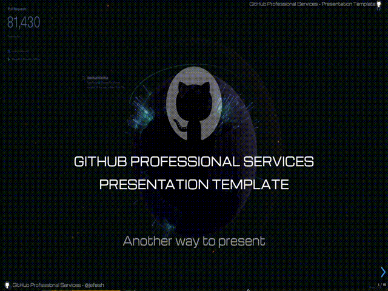
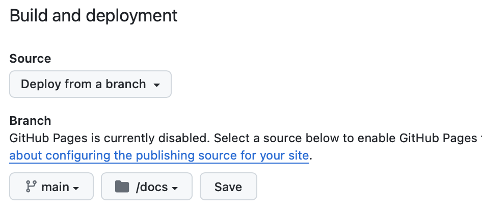

# Presentation Template

## [Demo](https://jefeish.github.io/presentation-template/)

A Repo template to use the `RevealJS presentation framework` with GitHub Pages

Create your own presentation Repository using this Repo as a template.



## Getting Started

### How do I run the `Pages` locally, to develope & test my presentation ?

- **Start the local `Reveal.js` server**

    in the `/docs` folder run...
    ```bash
    npm install
    npm start
    ```

- This will start the `Reveal.js` server on port `9000`

    http://localhost:9000

---

### How do I add/remove slides to my presentation ?

- To add new slides to your presentation, add a reference to the slide that you want to add, in the `/docs/index.html` file.

> **Note:** We provide a utility Node script (`dev/create-dev-index.js`) to help generate an `index.html` file for every content slide from the slides folder, use this for developement.
>
> :warning: The script OVERWRITES any existing silde references! So be careful not to lose any existing 'slide arrangements'

- For Example

    ```html
    ...
    <body>
        <div class="reveal">
            <div class="slides">
                <section data-background-image="images/backgrounds/mini-github.gif" data-transition="slide"  data-markdown="slides/cover.md">Cover</section>
                <section data-transition="slide"  data-markdown="slides/authors.md">Authors</section>
                <section data-transition="slide"  data-markdown="slides/overview.md">Overview</section>
                ...
    ```

    The each `<section...` represents a reference to a slide

- **We provide sample/layout pages for you to use as a reference**

    The `/docs/slides` folder contains a set of sample slides, showing you different layouts for your slides.
    Use any of the template slides that you want and include the slide with a reference in the `index.html` file.

---

### How do I create a new presentation from the template ?

- The template repo has several demo slides listed in the `docs/slides` folder (Markdown). These files are based on the `docs/slides-templates` folder. This content is just for demo purposes, when you start your own presentation, remove all the slides from the `docs/slides` folder or modify their content. Remember to update the slide references in the `index.html` file.

---

### How do I change the slide content ?

- The slides are based on Markdown (.md) files, due to advanced styling requirements we use very lightweight HTML elements, simply replace the sample text content with your own.

---

### How do I create/add images or diagrams ?

- For diagrams we recommend using [drawio](https://www.drawio.com), it's images are safed as XML files and can be exported to SVG, PNG etc. VS Code also has a Drawio plugin to support IDE based development.
- For images simply add them to the `/docs/images` folder and reference them in your Markdown slide.

>**NOTE:** Binary files such as `.png` etc. can increase the size of the Repo siginificantly! Try to use text based image sources, such as `.svg`.

---

### How do I change the style of my presentation ?

- **The `index.html` files contains references to several themes**, comment and un-comment the one you like to use/change.
- For Example

    ```html
    ...
        <title>Slide-Show</title>

        <link rel="stylesheet" href="revealjs/dist/reset.css">
        <link rel="stylesheet" href="revealjs/dist/reveal.css">
        <link rel="stylesheet" href="revealjs/plugin/title-footer/title-footer.css">
        <!-- <link rel="stylesheet" href="revealjs/themes/github-white.css"> -->
        <!-- <link rel="stylesheet" href="revealjs/themes/github-black.css"> -->
        <!-- <link rel="stylesheet" href="revealjs/themes/github.css"> -->
        <link rel="stylesheet" href="revealjs/themes/github-alien.css">
    ...
    ```
    
- The `CSS Styles` are located in, `/docs/revealjs/themes`, feel free to modify them but be aware that this can have interesting consequences.

#### ⚠️ NOTE: We wrote a small utility (Python) that allows you to switch between presentations and styles.

- Inside the `/docs` folder run the `presentation-options` program, it will list any `index.html.<some_name>` presentation option and allows you to select a specific one.
  Selecting one will copy the specific `index.html.<some_name>` over to the `index.html` file, therefore overwriting the `index.html` file.<br>
  To fully utilize that approach you should store all your individual "presentation index files" in individual `index.html.<some-name>` files and and allow for the `index.html` file to be overwritten.

  Example:

    

---

### How do I 'deploy' the presetation on GitHub ?

- **Enable [GitHub Pages](https://docs.github.com/en/pages/getting-started-with-github-pages/configuring-a-publishing-source-for-your-github-pages-site)**
- Set the `Pages` configuration to...



- The `Template Repo` contains all presetnation pages content under `/docs`

- After the `Pages Deployment` by GitHub you should be able to invoke the Presetation under the Pages URL provided by GitHub.

---

## NOTE

Some differences between using **Google Slides** and **Reveal.js**

- Reveal.js slides take most of their 'layout' arrangements from the `CSS Theme`. This gives us very good control over the layout.

- Google Slides provide the layout options on a `theme` level or directly on the `Slide`. This adds flexibility but also enables less control over the slides.

---
