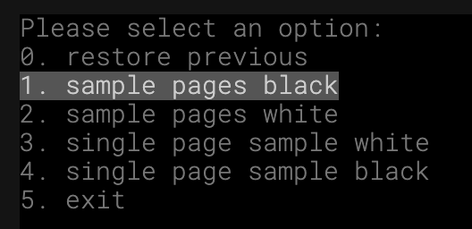

# Docs Folder Content

This is a Template Repository to use GitHub pages with [Reveal JS](https://revealjs.com) as your presentation platform

## To Run the Presentation in Development Mode

Inside the `/docs` folder run,

```bash
npm init
npm install
npm start
```

### Open Local Pages

http://localhost:9000/

Note: In the browser...

- Use `ESC` to see an overview of all slides in the presentation.
- Use `S` to see the presentation speaker notes.

### To Switch Between Presentations

- Run (in the `docs/` folder)

    ```bash
    presentation-options
    ```

 - Example

    

    >**Note:** switching between presentations (the index files), will overwrite the current `index.html` file and automatically update the life presentation.

---

## Content Description

|Files/Folders|Description|
|---|---|
|images/|Documentation images + source (drawio)|
|docs/revealjs/|[Reveal JS](https://revealjs.com) code, custom plugins and themes - to build GitHub pages|
|slides/|Source Markdown + HTML slide files, This is the content of the presentation|
|index.html|Reveal JS start page<br>**Note:** this file can be overwritten by custom `index` files <br>(see `presentation-option`)|
|index.html.<name_your_presetation>|A custom slides collection and style|
|presentation-option| A Python script to switch between multiple presentation `index` files|
|.nojekyll| disable Jekyll for GitHub pages|
