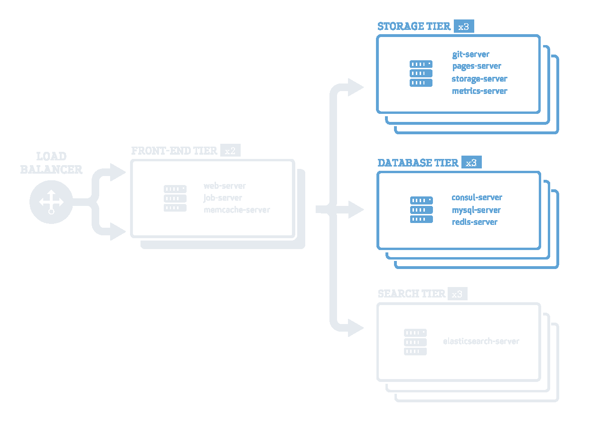

# Welcome to a Sample Page 
This sample comes from one markdown file that contains all presentation pages in one file (.md)

---

# Agenda

- Item 1
- Item 2
- Item 3
- Q&A

---

# Page 3

Lets explore more options

|Task|Description|
|---|---|
|task A| do something|
|task B| do something else|
|task C| stop doing it|

---

# Some 'Tricks'

    

        <h3>This is a very important page Please pay attention. Thank you!</h3>
    

    

        
    

---

# Some Coding Example

<pre><code data-line-numbers="3-5|8-10|13-15">
    private int partition(int arr[], int begin, int end) {
      int pivot = arr[end];
      int i = (begin-1);
      for (int j = begin; j < end; j++) {
        if (arr[j] <= pivot) {
            i++;
            int swapTemp = arr[i];
            arr[i] = arr[j];
            arr[j] = swapTemp;
        }
      }
      int swapTemp = arr[i+1];
      arr[i+1] = arr[end];
      arr[end] = swapTemp;
      return i+1;
    }
  </code></pre>

---

# Q & A

Feel free to ask us anything...